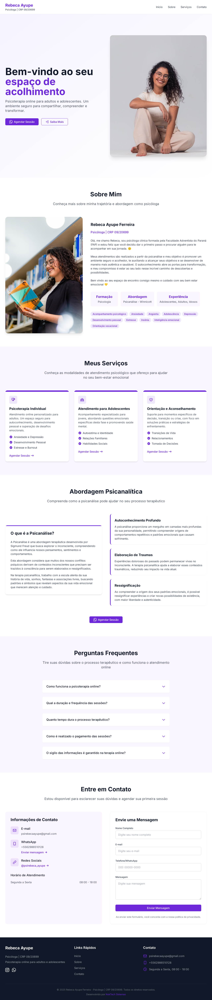

# Website para Psicóloga Rebeca Ayupe

[](https://astro.build/)
[](https://bun.sh/)
[](https://tailwindcss.com/)

## Visão Geral

Como parte de um projeto pessoal, estou desenvolvendo ferramentas para ajudar pessoas que vêm dedicando tempo e esforço para ajudar outras pessoas de forma popular ou até mesmo gratuitamente. Nosso objetivo é criar uma landing page para Rebeca Ayupe Ferreira, psicóloga com registro CRP 09/20699, especializada em psicoterapia online para adultos e adolescentes que atua em Goiânia - GO, com o intuito de ajudar a divulgar seu trabalho e atingir mais pessoas que buscam ajuda e não possuem condições de pagar por um serviço de psicólogo. A Dra. Rebeca Ayupe Ferreira oferece uma psicoterapia online de forma popular e acessível para todos.

## Objetivo

Nesse projeto em específico recebi algumas informações para o desenvolvimento de uma landing page profissional para a Dra. Rebeca Ayupe Ferreira, com intuito de divulgar seu trabalho utilizando o ASTRO como framework e o BUN como runtime, além de técnicas de otimização de performance para otimizar o carregamento da página e otimizar o SEO para melhor ranqueamento na busca do Google e outros motores.

## Informações de Contato

- **Instagram:** [@psirebeca_ayupe](https://www.instagram.com/psirebeca_ayupe/)
- **WhatsApp:** +55 62 98651-0128
- **Email:** [psirebecaayupe@gmail.com](mailto:psirebecaayupe@gmail.com)
- **Site:** [https://psirebecaayupe.com.br](https://psirebecaayupe.com.br)

## Especificações Técnicas

- **Framework:** Astro v5.5.5
- **Runtime:** Bun v1.2.8
- **CSS:** TailwindCSS v3.3.5
- **Hospedagem:** Hostinger (servidor Apache)
- **Distribuição:** Build estático (HTML + assets)
- **CDN:** Cloudflare

## Recursos Implementados

- Site de página única (one-page) com seções distintas
- Formulário de contato integrado com Formspree
- Integração com WhatsApp para mensagens diretas
- Página de agradecimento após envio de formulário
- Animações suaves com biblioteca AOS
- SEO otimizado com sitemap automático
- Design responsivo para todos os dispositivos
- Carregamento otimizado de imagens

## Requisitos de Design

- Estética visual limpa e profissional
- Animações suaves e sutis
- Design que transmita conforto e acolhimento
- Paleta de cores e elementos visuais alinhados com a área de psicologia
- Imagens profissionais da Dra. Rebeca Ayupe

## Boas Práticas Implementadas

- Código limpo e bem estruturado
- Configuração centralizada para fácil manutenção
- Otimização de imagens e assets
- Geração automática de sitemap para SEO
- Compressão HTML para melhor performance
- Meta tags otimizadas para redes sociais

## 🧞 Comandos

Todos os comandos são executados a partir da raiz do projeto, a partir de um terminal:

| Command                   | Ação                                              |
| :------------------------ | :-----------------------------------------------  |
| `bun install`             | Instala dependências                              |
| `bun dev`                 | Inicia o servidor de dev localmente na porta 4321 |
| `bun build`               | Gera o build do projeto para a pasta public_html/ |
| `bun preview`             | Visualiza o build localmente, antes de publicar   |
| `bun astro ...`           | Executa comandos como `astro add`, `astro check`  |
| `bun astro -- --help`     | Obtém ajuda usando o Astro CLI                    |

## Assets

- Qualquer asset estático, como imagens, pode ser colocado na pasta `public/`.
- Qualquer componente Astro/React/Vue/Svelte/Preact deve ser colocado na pasta `src/components/`.

## Estrutura de Pastas

```text
|── public_html/ (projeto compilado para servidor hospedado)
├── public/ (assets estáticos)
│   └── images/ (imagens do projeto)
│   └── icons/ (ícones e favicons)
├── src/ (código fonte do projeto)
│   ├── components/ (componentes Astro)
│   │   ├── About.astro
│   │   ├── Contact.astro
│   │   ├── FAQ.astro
│   │   ├── Footer.astro
│   │   ├── Header.astro
│   │   ├── Hero.astro
│   │   ├── PsychoanalysisApproach.astro
│   │   └── Services.astro
│   ├── layouts/ (layouts reutilizáveis)
│   │   └── Layout.astro
│   ├── pages/ (páginas do projeto)
│   │   ├── index.astro
│   │   └── obrigado.astro
│   ├── styles/ (estilos globais)
│   │   └── global.css
│   └── config.ts (configurações centralizadas)
├── astro.config.mjs
└── package.json
```

## Colocando o site no ar

1. Adicione a foto da Dra. Rebeca Ayupe na pasta `public/images/` com o nome adequado
2. Execute `bun run build` para gerar os arquivos estáticos
3. Faça o upload da pasta `public_html/` para o servidor Apache da Hostinger
4. Configure o domínio e SSL conforme necessário
5. Configure a CDN da Cloudflare para melhor desempenho

## Autor

<div align="center">
  
### Desenvolvido com ❤️ por [Brendown Ferreira](https://github.com/Br3n0k)
  
  [](https://github.com/Br3n0k)
  [](https://noktech.com.br)

  > "Transformando ideias em soluções digitais acessíveis para quem faz a diferença"
</div>

## Visualização do Site

Abaixo está uma visualização completa do site implementado:


